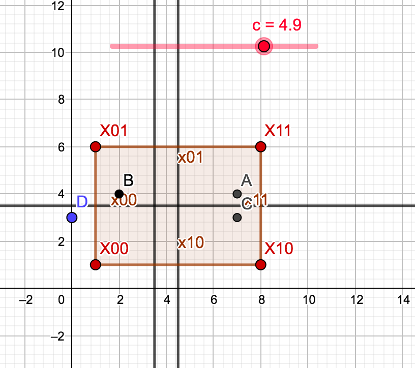

# Batman Puzzle Codingame (2nde version)

You only known if it is hot or cold... In fact, you sperate the playground with the perpandecular bisector. When it is hot, you known that the bomb is on your side, otherwithe is on the opposite.

if B is colder than A, the bomb is on the left side of the polygon X00,X01,X11,x10.